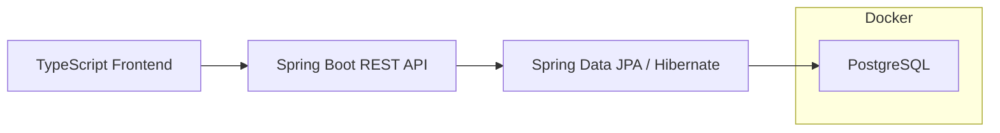

# Fitness Tracker

## About
A full-stack fitness tracking application designed to record workouts, track training progress, and explore exercise data.

This project is being developed as a learning and portfolio project, with a focus on building a real application using Java, Spring Boot, PostgreSQL and TypeScript.

**Status: Currently in development.**

---
## Goals
The main goals of the project are to:

- Build a practical fitness tracking application from the ground up
- Develop stronger Java and Spring Boot skills
- Design and work with a relational database
- Build a REST API
- Practise automated testing
- Develop a TypeScript frontend
- Use Docker for local development
- Learn how the different layers of a modern application fit together
- Create a project that can be extended as new technologies and ideas are explored
---
## Planned Features

### Exercise Management
- Store exercises and their descriptions
- Categorise exercises by movement or exercise type
- Record the primary and secondary muscles worked
- Search and filter exercises
- Potentially integrate an external exercise API

### Workout Tracking
- Create workouts
- Add exercises to workouts
- Record sets, repetitions and weight
- Record duration and distance where appropriate
- View previous workouts
- Track progression over time

### Progress Tracking
- Track personal records
- Track training volume
- Compare performance over time
- View workout history
- Eventually provide visualisations of training progress

### Dashboard
- A TypeScript-based frontend will eventually provide a dashboard for:
- Creating and recording workouts
- Viewing workout history
- Exploring exercises
- Viewing training statistics
- Visualising progress

---
## Technology Stack

### Backend
- Java 25
- Spring Boot
- Spring Web
- Spring Data JPA
- Hibernate
- Maven
- REST API

### Database
- PostgreSQL
- Docker

### Frontend
- TypeScript
- Planned dashboard framework: to be decided

### Development Tools
- IntelliJ IDEA
- Git
- GitHub
- Docker
---
## Architecture
The planned architecture is:

The application will be developed incrementally, with each feature implemented, tested and committed to Git before moving onto the next stage.

---
## Project Roadmap

### Phase 1
- [x] ~~Create Spring Boot project~~
- [x] ~~Configure Maven~~
- [x] ~~Configure Git and create GitHub repo~~
- [x] ~~Create PostgreSQL Docker container~~
- [ ] Connect Spring Boot to PostgreSQL

### Phase 2
- [ ] Design exercise data model
- [ ] Create Exercise entity
- [ ] Create Exercise repository
- [ ] Create Exercise service
- [ ] Create Exercise REST endpoints
- [ ] Add validation
- [ ] Add automated tests

### Phase 3 — Workout Tracking
- [ ] Design workout data model
- [ ] Create workout entities
- [ ] Record exercises, sets, repetitions and weight
- [ ] Create workout REST endpoints
- [ ] Add validation
- [ ] Add automated tests

### Phase 4 — Training History & Progress
- [ ] Workout history
- [ ] Personal records
- [ ] Training volume calculations
- [ ] Progress tracking
- [ ] Statistics endpoints

### Phase 5 — TypeScript Dashboard
- [ ] Create frontend project
- [ ] Connect frontend to REST API
- [ ] Exercise browsing
- [ ] Workout creation
- [ ] Workout history
- [ ] Progress dashboard
- [ ] Training visualisations

---
## Future Ideas

### Phase 6 — Extensions
- Potential future features include:
- User accounts and authentication
- External exercise API integration
- MongoDB integration (where appropriate)
- Advanced analytics
- AI/ML-based training analysis

